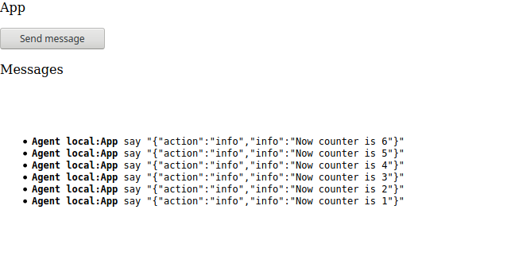
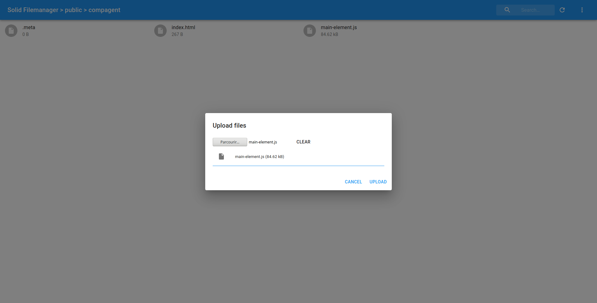

Lit-element Webcomponent that communicate with evejs  https://scenaristeur.github.io/compagent-tuto/

# Why using Lit-element with evejs ?
Lit-element is a good tool to build customElements, but there are some problems with data-binding :
- only works parents to child, and reverse is difficult
- not really friendly when you want to move a child component from a parent to another
- evejs agen give us more independant components


# Based on Webpack Getting started

https://webpack.js.org/guides/getting-started/

```
mkdir compagent-tuto
cd compagent-tuto
npm init -y
npm install webpack webpack-cli --save-dev
touch index.html
mkdir src
cd src
touch index.js
cd ..
npm install --save lodash
```

https://github.com/scenaristeur/compagent-tuto/tree/6530d16fdbd77e34bf6c20000ac443cdbc7304dc

#Building
```
npm run build
```
--> evrything is bundled in /dist

# Building a compagent
```
npm install --save lit-element scenaristeur/evejs
```

# Add Lit-element
https://github.com/scenaristeur/compagent-tuto/tree/5634f6b4b188cb3e477b478d1ecafa60bac55322

# Add evejs communication
https://github.com/scenaristeur/compagent-tuto/tree/768e86946c82d04c109fe4dbc3a4754eb476f8b5


Now we can build our components

change my-element to app-element



Make an index.html & copy code of your /dist/index.html
then use filemanager to upload /dist/main-element.js


see it live on https://smag0.solid.community/public/compagent/tuto/00basic/

or https://scenaristeur.github.io/compagent-tuto/


# make a gh-pages branches
https://stackoverflow.com/questions/36782467/set-subdirectory-as-website-root-on-github-pages

git add dist && git commit -m "Initial dist subtree commit"

git subtree push --prefix dist origin gh-pages


https://github.com/scenaristeur/compagent-tuto/tree/c1bade1b2992dd8dc80b428921e74e7e7f678804


# So for webcomponents with evejs, the Basic Code is

/dist/index.html
```
<!doctype html>
<html>
<head>
  <meta charset="utf-8">
  <meta name="viewport" content="width=device-width, initial-scale=1.0">
  <title>Compagent Tuto</title>
</head>
<body>
  <main-element></main-element>
  <script src="main-element.js"></script>
  <a href="https://smag0.solid.community/public/compagent/tuto/00basic/" target="_blank">Hosted on a Pod</a>
  <a href="https://scenaristeur.github.io/compagent-tuto/" target="_blank">Hosted on gh-pages</a>
  <a href="https://github.com/scenaristeur/compagent-tuto" target="_blank">Tuto</a>
</body>
</html>
```

This file calls the main-element.js build by "npm run build" command. This command build /dist/main-element.js from /src/main-element.js.
This allow us to use a CustomElement "main-element"


/src/main-element.js
```
import { LitElement, html } from 'lit-element';
import './component/app-element.js';
import './component/messages-element.js';

class MainElement extends LitElement{
  render(){
    return html`
    <app-element name="App"></app-element>
    <messages-element name="Messages"></messages-element>
    `;
  }
}
customElements.define('main-element', MainElement);
```

Here we call two CustomElements /component/app-element.js & /component/messages-element.js

/component/app-element.js
```
import { LitElement, html } from 'lit-element';
import { HelloAgent } from '../agents/hello-agent.js';

class AppElement extends LitElement {

  static get properties() {
    return {
      name: {type: String},
      count: {type: Number}
    };
  }

  constructor() {
    super();
    this.count = 0
  }

  render(){
    return html`
    <p>${this.name}</p>
    <button @click="${this.sendMessage}">Send message</button>
    `;
  }

  firstUpdated(){
    var app = this;
    this.agent = new HelloAgent(this.name);
    this.agent.receive = function(from, message) {
      if (message.hasOwnProperty("action")){
        switch(message.action) {
          case "doSomething":
          app.doSomething(message);
          break;
          default:
          console.log("Unknown action ",message)
        }
      }
    };
  }

  doSomething(message){
    console.log(message)
  }

  sendMessage(){
    this.count++
    this.agent.send("Messages", {action:"info", info:"Now counter is "+this.count}  )
  }

}

customElements.define('app-element', AppElement);

```


/component/messages-element.js
```
import { LitElement, html } from 'lit-element';
import { HelloAgent } from '../agents/hello-agent.js';

class MessagesElement extends LitElement {

  static get properties() {
    return {
      name: {type: String},
      messages: {type: Array}
    };
  }

  constructor() {
    super();
    this.name = "unknown"
    this.messages =  []
  }
  render(){
    return html`
    <p>${this.name}</p>
    <pre class="pre-scrollable">
    <ul id="messageslist">
    ${this.messages.map((m) => html`<li><b>Agent ${m.from}</b> say "${m.message}"</li>`)}
    </ul>
    </pre>
    `;
  }

  firstUpdated(){
    var app = this;
    this.agent = new HelloAgent(this.name);
    this.agent.receive = function(from, message) {

      if (message.hasOwnProperty("action")){
        switch(message.action) {
          case "info":
          app.addInfo(from, message)
          break;
          default:
          console.log("Unknown action ",message)
        }
      }
    };
  }

  addInfo(from, message){
    this.messages.reverse()
    this.messages = [... this.messages, {message: JSON.stringify(message), from: from}]
    this.messages.reverse()
  }

}

customElements.define('messages-element', MessagesElement);


```

# Solid component

now let's build our first solid component named "login-element" by duplicating /src/modele-component and adding it to /src/main-element.js

/src/main-element.js
```
import { LitElement, html } from 'lit-element';
import './component/app-element.js';
import './component/messages-element.js';
import './component/login-element.js';

class MainElement extends LitElement{
  render(){
    return html`
    <app-element name="App"></app-element>
    <login-element name="Login"></login-element>
    <messages-element name="Messages"></messages-element>
    `;
  }
}
customElements.define('main-element', MainElement);
```

 Initial /src/component/login-element.js
```
import { LitElement, html } from 'lit-element';
import { HelloAgent } from '../agents/hello-agent.js';

class LoginElement extends LitElement {

  static get properties() {
    return {
      name: {type: String},
      count: {type: Number}
    };
  }

  constructor() {
    super();
    this.count = 0
  }

  render(){
    return html`
    <p>${this.name}</p>
    <button @click="${this.sendMessage}">Send message</button>
    `;
  }

  firstUpdated(){
    var app = this;
    this.agent = new HelloAgent(this.name);
    this.agent.receive = function(from, message) {
      if (message.hasOwnProperty("action")){
        switch(message.action) {
          case "doSomething":
          app.doSomething(message);
          break;
          default:
          console.log("Unknown action ",message)
        }
      }
    };
  }

  doSomething(message){
    console.log(message)
  }

  sendMessage(){
    this.count++
    this.agent.send("Messages", {action:"info", info:"Now counter is "+this.count}  )
  }

}

customElements.define('login-element', LoginElement);
```


And update it like this

first install [solid-auth-client](https://github.com/solid/solid-auth-client)

```
npm install solid-auth-client
```

Updated : /src/component/login-element.js

```


```
