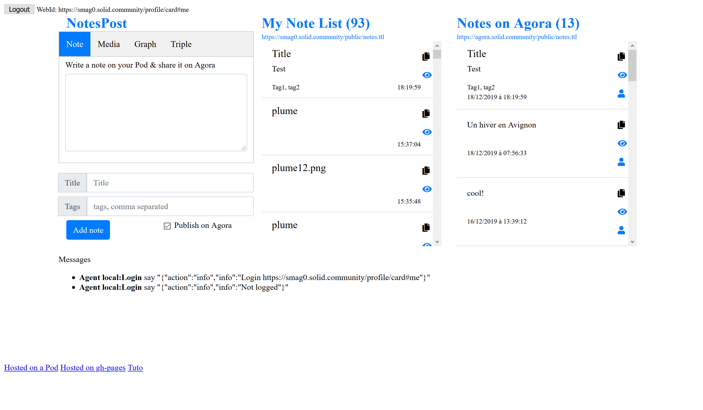

# todo
use https://github.com/blueimp/JavaScript-Load-Image to reduce image size before upload

Lit-element Webcomponent that communicate with evejs  https://scenaristeur.github.io/compagent-tuto/

# Why using Lit-element with evejs ?
Lit-element is a good tool to build customElements, but there are some problems with data-binding :
- only works parents to child, and reverse is difficult
- not really friendly when you want to move a child component from a parent to another
- evejs agen give us more independant components


# Based on Webpack Getting started

https://webpack.js.org/guides/getting-started/

```
mkdir compagent-tuto
cd compagent-tuto
npm init -y
npm install webpack webpack-cli --save-dev
touch index.html
mkdir src
cd src
touch index.js
cd ..
npm install --save lodash
```


# ajout webpack -dev-server

```
npm install webpack-dev-server --save-dev


```
--> npm start

https://github.com/scenaristeur/compagent-tuto/tree/6530d16fdbd77e34bf6c20000ac443cdbc7304dc

#Building
```
npm run build
```
--> evrything is bundled in /dist

# Building a compagent
```
npm install --save lit-element scenaristeur/evejs
```

# Add Lit-element
https://github.com/scenaristeur/compagent-tuto/tree/5634f6b4b188cb3e477b478d1ecafa60bac55322

# Add evejs communication
https://github.com/scenaristeur/compagent-tuto/tree/768e86946c82d04c109fe4dbc3a4754eb476f8b5


Now we can build our components

change my-element to app-element


Make an index.html & copy code of your /dist/index.html
then use filemanager to upload /dist/main-element.js


see it live on https://smag0.solid.community/public/compagent/tuto/00basic/

or https://scenaristeur.github.io/compagent-tuto/


# make a gh-pages branches
https://stackoverflow.com/questions/36782467/set-subdirectory-as-website-root-on-github-pages

git add dist && git commit -m "Initial dist subtree commit"

npm run build && git subtree push --prefix dist origin gh-pages


https://github.com/scenaristeur/compagent-tuto/tree/c1bade1b2992dd8dc80b428921e74e7e7f678804


# So for webcomponents with evejs, the Basic Code is

/dist/index.html
```
<!doctype html>
<html>
<head>
  <meta charset="utf-8">
  <meta name="viewport" content="width=device-width, initial-scale=1.0">
  <title>Compagent Tuto</title>
</head>
<body>
  <main-element></main-element>
  <script src="main-element.js"></script>
  <a href="https://smag0.solid.community/public/compagent/tuto/00basic/" target="_blank">Hosted on a Pod</a>
  <a href="https://scenaristeur.github.io/compagent-tuto/" target="_blank">Hosted on gh-pages</a>
  <a href="https://github.com/scenaristeur/compagent-tuto" target="_blank">Tuto</a>
</body>
</html>
```

This file calls the main-element.js build by "npm run build" command. This command build /dist/main-element.js from /src/main-element.js.
This allow us to use a CustomElement "main-element"


/src/main-element.js
```
import { LitElement, html } from 'lit-element';
import './component/app-element.js';
import './component/messages-element.js';

class MainElement extends LitElement{
  render(){
    return html`
    <app-element name="App"></app-element>
    <messages-element name="Messages"></messages-element>
    `;
  }
}
customElements.define('main-element', MainElement);
```

Here we call two CustomElements /component/app-element.js & /component/messages-element.js

/component/app-element.js
```
import { LitElement, html } from 'lit-element';
import { HelloAgent } from '../agents/hello-agent.js';

class AppElement extends LitElement {

  static get properties() {
    return {
      name: {type: String},
      count: {type: Number}
    };
  }

  constructor() {
    super();
    this.count = 0
  }

  render(){
    return html`
    <p>${this.name}</p>
    <button @click="${this.sendMessage}">Send message</button>
    `;
  }

  firstUpdated(){
    var app = this;
    this.agent = new HelloAgent(this.name);
    this.agent.receive = function(from, message) {
      if (message.hasOwnProperty("action")){
        switch(message.action) {
          case "doSomething":
          app.doSomething(message);
          break;
          default:
          console.log("Unknown action ",message)
        }
      }
    };
  }

  doSomething(message){
    console.log(message)
  }

  sendMessage(){
    this.count++
    this.agent.send("Messages", {action:"info", info:"Now counter is "+this.count}  )
  }

}

customElements.define('app-element', AppElement);

```


/component/messages-element.js
```
import { LitElement, html } from 'lit-element';
import { HelloAgent } from '../agents/hello-agent.js';

class MessagesElement extends LitElement {

  static get properties() {
    return {
      name: {type: String},
      messages: {type: Array}
    };
  }

  constructor() {
    super();
    this.name = "unknown"
    this.messages =  []
  }
  render(){
    return html`
    <p>${this.name}</p>
    <pre class="pre-scrollable">
    <ul id="messageslist">
    ${this.messages.map((m) => html`<li><b>Agent ${m.from}</b> say "${m.message}"</li>`)}
    </ul>
    </pre>
    `;
  }

  firstUpdated(){
    var app = this;
    this.agent = new HelloAgent(this.name);
    this.agent.receive = function(from, message) {

      if (message.hasOwnProperty("action")){
        switch(message.action) {
          case "info":
          app.addInfo(from, message)
          break;
          default:
          console.log("Unknown action ",message)
        }
      }
    };
  }

  addInfo(from, message){
    this.messages.reverse()
    this.messages = [... this.messages, {message: JSON.stringify(message), from: from}]
    this.messages.reverse()
  }

}

customElements.define('messages-element', MessagesElement);


```

# Solid component

now let's build our first solid component named "login-element" by duplicating /src/modele-component and adding it to /src/main-element.js

/src/main-element.js
```
import { LitElement, html } from 'lit-element';
import './component/app-element.js';
import './component/messages-element.js';
import './component/login-element.js';

class MainElement extends LitElement{
  render(){
    return html`
    <app-element name="App"></app-element>
    <login-element name="Login"></login-element>
    <messages-element name="Messages"></messages-element>
    `;
  }
}
customElements.define('main-element', MainElement);
```

 Initial /src/component/login-element.js
```
import { LitElement, html } from 'lit-element';
import { HelloAgent } from '../agents/hello-agent.js';

class LoginElement extends LitElement {

  static get properties() {
    return {
      name: {type: String},
      count: {type: Number}
    };
  }

  constructor() {
    super();
    this.count = 0
  }

  render(){
    return html`
    <p>${this.name}</p>
    <button @click="${this.sendMessage}">Send message</button>
    `;
  }

  firstUpdated(){
    var app = this;
    this.agent = new HelloAgent(this.name);
    this.agent.receive = function(from, message) {
      if (message.hasOwnProperty("action")){
        switch(message.action) {
          case "doSomething":
          app.doSomething(message);
          break;
          default:
          console.log("Unknown action ",message)
        }
      }
    };
  }

  doSomething(message){
    console.log(message)
  }

  sendMessage(){
    this.count++
    this.agent.send("Messages", {action:"info", info:"Now counter is "+this.count}  )
  }

}

customElements.define('login-element', LoginElement);
```


And update it like this

first install [solid-auth-client](https://github.com/solid/solid-auth-client)

```
npm install solid-auth-client
```

add solid-auth-client/dist-popup to /dist/dist-popup

Updated : /src/component/login-element.js

```
import { LitElement, html } from 'lit-element';
import { HelloAgent } from '../agents/hello-agent.js';
//const auth = require('solid-auth-client')
import * as auth from 'solid-auth-client'

class LoginElement extends LitElement {

  static get properties() {
    return {
      name: {type: String},
      count: {type: Number},
      webId: {type: String}
    };
  }

  constructor() {
    super();
    this.count = 0
    this.webId = null
  }

  render(){
    return html`
    <p>${this.name}</p>


    ${this.webId == null ?
      html`
      <button @click=${this.login}>Login</button>
      `
      : html`
      <p>WebId: ${this.webId}</p>
      <button @click=${this.logout}>Logout</button>`
    }


    <button @click="${this.sendMessage}">Send message</button>
    `;
  }

  firstUpdated(){
    var app = this;
    this.agent = new HelloAgent(this.name);
    this.agent.receive = function(from, message) {
      if (message.hasOwnProperty("action")){
        switch(message.action) {
          case "doSomething":
          app.doSomething(message);
          break;
          default:
          console.log("Unknown action ",message)
        }
      }
    };

    auth.trackSession(session => {
      if (!session){
        console.log("notlogged")
        this.webId=null
        this.agent.send('Messages',  {action:"info", info:"Not logged"});
      }
      else{
        app.webId = session.webId
        this.agent.send('Messages',  {action:"info", info:"Login "+app.webId});
      }
    })
  }

  login(event) {
    this.popupLogin();
  }

  logout(event) {
    auth.logout().then(() => alert('Goodbye!'));
    this.agent.send('Messages',  {action:"info", info:"Logout"});
  }

  async popupLogin() {
    let session = await auth.currentSession();
    let popupUri = './dist-popup/popup.html';
    if (!session)
    session = await auth.popupLogin({ popupUri });
  }

  doSomething(message){
    console.log(message)
  }

  sendMessage(){
    this.count++
    this.agent.send("Messages", {action:"info", info:"This webid is "+this.webId}  )
  }

}

customElements.define('login-element', LoginElement);


```


git tag -a v0.0 -m "lit-element evejs solid-auth-client"

[first release : lit-element + evejs + solid-auth-client](https://github.com/scenaristeur/compagent-tuto/releases/tag/v0.0)


Now when can create independant CustomElements that commincate with each other and use Solid as a backend


# AgoraNotesElement

for example, building a customElement that retrieve the notes published on agora's POD could be build like this :
- duplicate /src/modele-element.js & name it agora-notes-element.js
- import it in src/main-element.js


/src/main-element.js
```
import { LitElement, html } from 'lit-element';
import './component/app-element.js';
import './component/messages-element.js';
import './component/login-element.js';
import './component/agora-notes-element.js';

class MainElement extends LitElement{
  render(){
    return html`
    <app-element name="App"></app-element>
    <login-element name="Login"></login-element>
    <agora-notes-element name="AgoraNotes"></agora-notes-element>
    <messages-element name="Messages"></messages-element>
    `;
  }
}
customElements.define('main-element', MainElement);

```

install tripledoc & rdf-namespaces

```
npm install tripledoc rdf-namespaces --save
```

next using tripledoc, we can build components that interact with Solid simply like that

```
import { LitElement, html } from 'lit-element';
import { HelloAgent } from '../agents/hello-agent.js';

import { fetchDocument } from 'tripledoc';
import { schema, rdfs, rdf } from 'rdf-namespaces';

class AgoraNotesElement extends LitElement {

  static get properties() {
    return {
      name: {type: String},
      count: {type: Number},
      agoraNotesListUrl: {type: String},
      notes: {type: Array},
      lang: {type: String}
    };
  }

  constructor() {
    super();
    this.count = 0
    this.notes = []
    this.agoraNotesListUrl = "https://agora.solid.community/public/notes.ttl"
    this.lang=navigator.language
  }

  render(){
    const noteList = (notes) => html`
    <h3>Notes on Agora (${notes.length})</h3>
    <button
    href="${this.agoraNotesListUrl}"
    target="_blank">
    ${this.agoraNotesListUrl}
    </button>

    <ul>
    ${notes.map((n) => html`
      <li>
      <div>${n.text}</div>
      <!--<small>Donec id elit non mi porta.</small>-->
      <small>${n.date.toLocaleString(this.lang, { timeZone: 'UTC' })}</small><br>
      <a  href="${n.creator}" ?hidden=${n.creator == null} target="_blank" title="${n.creator}">Creator</a>

      <a href="${n.also}" ?hidden=${n.also == null} title="${n.also}" target="_blank">See Also</a>
      </li>
      `)}
      </ul>
      `;

      return html`
      ${noteList(this.notes)}
      `;
    }

    firstUpdated(){
      var app = this;
      this.agent = new HelloAgent(this.name);
      this.agent.receive = function(from, message) {
        if (message.hasOwnProperty("action")){
          switch(message.action) {
            case "doSomething":
            app.doSomething(message);
            break;
            default:
            console.log("Unknown action ",message)
          }
        }
      };
      this.getAgoraData()
    }

    getAgoraData(){
      var app = this
      fetchDocument(app.agoraNotesListUrl).then(
        notesList => {
          app.notesList = notesList;
          app.notesUri = notesList.findSubjects(rdf.type, schema.TextDigitalDocument)
          app.notes = []
          app.notesUri.forEach(function (nuri){
            var text = nuri.getString(schema.text)
            var date = nuri.getDateTime(schema.dateCreated)
            var creator = nuri.getRef(schema.creator)
            var also = nuri.getRef(rdfs.seeAlso)
            //  console.log(text, date)
            var note = {}
            note.text = text;
            note.date = date;
            note.creator = creator;
            note.also = also;
            //text = nuri.getAllStrings()*/
            app.notes = [... app.notes, note]
          })
          app.notes.reverse()
          if (app.socket == undefined){
            app.subscribe()
          }else{
            console.log("socket exist deja")
          }

        })
      }

      subscribe(){
        var app = this
        //https://github.com/scenaristeur/spoggy-chat-solid/blob/master/index.html
        var websocket = this.notesList.getWebSocketRef();
        console.log("WEBSOCK",websocket)
        app.socket = new WebSocket(websocket);
        console.log ("socket",app.socket)
        app.socket.onopen = function() {
          const d = new Date();
          var now = d.toLocaleTimeString(app.lang) + `.${d.getMilliseconds()}`
          this.send('sub '+app.agoraNotesListUrl);
          app.agent.send('Messages', now+"[souscription] "+app.agoraNotesListUrl)
          console.log("OPENED SOCKET",app.socket)
        };
        app.socket.onmessage = function(msg) {
          if (msg.data && msg.data.slice(0, 3) === 'pub') {
            const d = new Date();
            var now = d.toLocaleTimeString(app.lang) + `.${d.getMilliseconds()}`
            app.getAgoraData()
          }
          else{console.log("message inconnu",msg)}
        };
      }

    }

    customElements.define('agora-notes-element', AgoraNotesElement);
```
(
NB the subscribe function connects a Web socket to the agoraNotesListUrl that allow live refresh . If you want to post, try https://scenaristeur.github.io/compagent/shexy-component/)

# release v0.1 post notes / video / audio / images and see personnal notes & agora's notes



# couleurs
https://encycolorpedia.fr/c7f3fc
